# Quietschente – SOLID Datenarchitektur: Klassen- & Objektdiagramm

**Version:** 1.0 | **Datum:** 2026-06-28 | **Basis:** ADR-4 aus Architektur-Plan

---

## SOLID-Prinzipien: Mapping auf Quietschente

| Prinzip | Konkrete Entscheidung |
|---------|----------------------|
| **S** – Single Responsibility | `SpamCheckService` prüft nur Spam; `EmailService` sendet nur E-Mails; `RegistrationService` orchestriert nur den Anmeldeprozess |
| **O** – Open/Closed | Neuen E-Mail-Provider = neue Klasse, die `IEmailSender` implementiert. Kein bestehender Code ändert sich. Gleiches gilt für neue Event-Typen via `IEventTypeConfig` |
| **L** – Liskov Substitution | `BrevoEmailSender` und `GasMailAppSender` sind vollständig austauschbar. `GoogleSheetsRegistrationRepository` kann jederzeit durch `SupabaseRegistrationRepository` ersetzt werden |
| **I** – Interface Segregation | `IRegistrationRepository` erweitert nur `IRepository<Registration>` um anmeldungsspezifische Methoden. Kein Service wird gezwungen, Methoden zu implementieren, die er nicht braucht |
| **D** – Dependency Inversion | `RegistrationService` kennt nur `IRegistrationRepository`, nie `GoogleSheetsRegistrationRepository`. Die Bindung an Sheets ist eine Konfigurationsentscheidung, keine Architekturentscheidung |

---

## Klassendiagramm

```mermaid
classDiagram

    %% ─────────────────────────────────────
    %% VALUE OBJECTS (immutable)
    %% ─────────────────────────────────────

    class Token {
        -value: string
        +constructor(length: number)$
        +constructor(existing: string)$
        +toString() string
        +equals(other: Token) bool
    }

    class Email {
        -value: string
        +constructor(raw: string)
        +toString() string
        +domain() string
        +validate(raw: string)$ bool
    }

    class EventPhase {
        -value: int
        +constructor(value: int)
        +label() string
        +canTransitionTo(next: EventPhase) bool
        +IDEA$ EventPhase
        +SCHEDULING$ EventPhase
        +INVITATION$ EventPhase
        +REGISTRATION$ EventPhase
        +PREPARATION$ EventPhase
        +EXECUTION$ EventPhase
        +AFTERMATH$ EventPhase
        +REENGAGEMENT$ EventPhase
    }

    %% ─────────────────────────────────────
    %% CORE ENTITIES
    %% ─────────────────────────────────────

    class Group {
        -id: string
        +name: string
        +slug: string
        +settings: GroupSettings
        +constructor(name: string, slug: string)
        +reconstruct(data: object)$ Group
        +updateSettings(settings: GroupSettings) void
    }

    class Profile {
        -id: string
        -email: Email
        -token: Token
        +displayName: string
        +preferences: object
        +badges: Badge[]
        +constructor(email: Email, displayName: string)
        +reconstruct(data: object)$ Profile
        +addBadge(badge: Badge) void
        +updatePreferences(prefs: object) void
        +hasAttended(eventId: string) bool
    }

    class Event {
        -id: string
        -groupId: string
        -type: string
        -phase: EventPhase
        +title: string
        +date: Date
        +startTime: string
        +maxParticipants: int
        +typeConfig: object
        +constructor(groupId: string, type: string, title: string, date: Date)
        +reconstruct(data: object)$ Event
        +advancePhase() void
        +close() void
        +isOpen() bool
        +isFull(currentCount: int) bool
        +isOutdoor() bool
    }

    class Registration {
        -id: string
        -eventId: string
        -profileId: string
        -actionToken: Token
        -status: string
        -version: int
        +fieldAnswers: object
        +constructor(eventId: string, profileId: string, fieldAnswers: object)
        +reconstruct(data: object)$ Registration
        +approve() void
        +flagForReview(reason: string) void
        +reject(reason: string) void
        +cancel() void
        +edit(newAnswers: object) Registration
        +isEditable() bool
    }

    class EventTypeField {
        -type: string
        -fieldKey: string
        +fieldLabel: string
        +fieldType: string
        +required: bool
        +sortOrder: int
        +constructor(type: string, key: string, label: string, fieldType: string, required: bool)
        +validate(value: string) bool
    }

    class SpamRule {
        -id: string
        +pattern: string
        +ruleType: string
        +action: string
        +active: bool
        +constructor(pattern: string, ruleType: string, action: string)
        +matches(text: string) bool
    }

    class EmailLog {
        -id: string
        -profileId: string
        -eventId: string
        +templateKey: string
        +sentAt: Date
        +status: string
        +constructor(profileId: string, eventId: string, templateKey: string)
        +markDelivered() void
        +markFailed(reason: string) void
    }

    %% ─────────────────────────────────────
    %% INTERFACES (Repository + Sender)
    %% ─────────────────────────────────────

    class IRepository {
        <<interface>>
        +findById(id: string) T
        +save(entity: T) void
        +delete(id: string) void
    }

    class IRegistrationRepository {
        <<interface>>
        +findByToken(token: string) Registration
        +findByEventId(eventId: string) Registration[]
        +findByProfileId(profileId: string) Registration[]
        +findPending() Registration[]
    }

    class IEventRepository {
        <<interface>>
        +findOpenByGroup(groupId: string) Event[]
        +findByDateRange(from: Date, to: Date) Event[]
    }

    class IEmailSender {
        <<interface>>
        +send(to: Email, subject: string, html: string) void
    }

    class IEmailTemplateRepository {
        <<interface>>
        +getTemplate(key: string) EmailTemplate
        +render(key: string, vars: object) string
    }

    %% ─────────────────────────────────────
    %% INFRASTRUKTUR (konkrete Implementierungen)
    %% ─────────────────────────────────────

    class GoogleSheetsRegistrationRepository {
        -sheetId: string
        +constructor(sheetId: string)
        +findById(id: string) Registration
        +findByToken(token: string) Registration
        +save(registration: Registration) void
        +delete(id: string) void
        +findPending() Registration[]
        +findByEventId(eventId: string) Registration[]
        +findByProfileId(profileId: string) Registration[]
    }

    class GasMailAppSender {
        +send(to: Email, subject: string, html: string) void
    }

    class BrevoEmailSender {
        -apiKey: string
        +constructor(apiKey: string)
        +send(to: Email, subject: string, html: string) void
    }

    class SheetEmailTemplateRepository {
        -sheetId: string
        +constructor(sheetId: string)
        +getTemplate(key: string) EmailTemplate
        +render(key: string, vars: object) string
    }

    %% ─────────────────────────────────────
    %% DOMAIN SERVICES
    %% ─────────────────────────────────────

    class SpamCheckService {
        -rules: SpamRule[]
        +constructor(rules: SpamRule[])
        +check(registration: Registration) SpamCheckResult
        -isHoneypotTriggered(data: object) bool
        -isTooFast(submittedAt: int) bool
        -matchesRules(text: string) SpamRuleMatch
    }

    class EmailService {
        -sender: IEmailSender
        -templates: IEmailTemplateRepository
        -log: EmailLog[]
        +constructor(sender: IEmailSender, templates: IEmailTemplateRepository)
        +sendConfirmation(profile: Profile, reg: Registration, event: Event) void
        +sendReminder(profile: Profile, reg: Registration, event: Event) void
        +sendDayOf(profile: Profile, reg: Registration, event: Event) void
        +sendPostEvent(profile: Profile, event: Event) void
        +sendReengagement(profile: Profile, event: Event) void
    }

    class RegistrationService {
        -regRepo: IRegistrationRepository
        -profileRepo: IRepository
        -spamChecker: SpamCheckService
        -emailService: EmailService
        +constructor(regRepo, profileRepo, spamChecker, emailService)
        +register(command: RegisterCommand) Registration
        +edit(token: string, updates: object) Registration
        +cancel(token: string) void
        +approve(id: string) void
        +reject(id: string, reason: string) void
    }

    class EventLifecycleService {
        -eventRepo: IEventRepository
        -emailService: EmailService
        +constructor(eventRepo, emailService)
        +advanceToNextPhase(eventId: string) Event
        +autoCloseIfPast(event: Event) void
        +openForRegistration(eventId: string) void
    }

    %% ─────────────────────────────────────
    %% BEZIEHUNGEN
    %% ─────────────────────────────────────

    IRegistrationRepository --|> IRepository : extends
    IEventRepository --|> IRepository : extends

    GoogleSheetsRegistrationRepository ..|> IRegistrationRepository : implements
    GasMailAppSender ..|> IEmailSender : implements
    BrevoEmailSender ..|> IEmailSender : implements
    SheetEmailTemplateRepository ..|> IEmailTemplateRepository : implements

    Profile --> Email : has
    Profile --> Token : has
    Registration --> Token : has
    Event --> EventPhase : has

    RegistrationService --> IRegistrationRepository : depends on
    RegistrationService --> SpamCheckService : uses
    RegistrationService --> EmailService : uses
    EmailService --> IEmailSender : depends on
    EmailService --> IEmailTemplateRepository : depends on
    EventLifecycleService --> IEventRepository : depends on
    EventLifecycleService --> EmailService : uses

    Registration --> Profile : references
    Registration --> Event : references
    Event --> Group : belongs to
    EmailLog --> Profile : references
    EmailLog --> Event : references
```



---

## Objektdiagramm: BBQ-Abend Szenario

Ein konkretes Beispiel: Lotta erstellt einen BBQ-Abend. Moritz meldet sich an.

```
┌─────────────────────────────────────────┐
│ :Group                                  │
│  id = "grp_zuri_stammtisch"            │
│  name = "Züri Stammtisch"              │
│  slug = "zuri-stammtisch"              │
│  settings = {                           │
│    spamFilterActive: true,              │
│    emailProvider: "brevo",              │
│    maxEventsOpen: 2                     │
│  }                                      │
└─────────────────────────────────────────┘
              │ belongs to
              ▼
┌─────────────────────────────────────────┐
│ :Event                                  │
│  id = "evt_bbq_2026_08_15"            │
│  groupId = "grp_zuri_stammtisch"       │
│  type = "bbq"                          │
│  title = "Sommer-BBQ im Moospark"     │
│  date = 2026-08-15                     │
│  startTime = "17:00"                   │
│  phase = EventPhase(3)  ← REGISTRATION │
│  maxParticipants = 15                  │
│  typeConfig = {                         │
│    weatherPlanB: "Pavillon vorhanden", │
│    grillSlots: 3,                       │
│    bringAlongLabel: "Fürs Grillieren?" │
│  }                                      │
└─────────────────────────────────────────┘
              │ registered for
              ▼
┌─────────────────────────────────────────┐   ┌─────────────────────────────────────┐
│ :Registration                           │   │ :Profile (Moritz)                   │
│  id = "reg_moritz_bbq"                 │   │  id = "prf_moritz"                  │
│  eventId = "evt_bbq_2026_08_15"        │   │  email = :Email("moritz@mail.ch")   │
│  profileId = "prf_moritz"              │◀──│  token = :Token("xK9mP2qR...")      │
│  actionToken = :Token("aB3cD9...")     │   │  displayName = "Moritz"             │
│  status = "angemeldet"                 │   │  preferences = {                    │
│  version = 1                           │   │    mitbringsel: "Würste",           │
│  fieldAnswers = {                      │   │    ernährung: "alles"               │
│    mitbringsel: "Würste und Brot",     │   │  }                                  │
│    hinweise: "vegetarisch für Tine",   │   │  badges = [:Badge("Erstanmeldung")] │
│    antwort: "ja"                       │   └─────────────────────────────────────┘
│  }                                     │
└─────────────────────────────────────────┘
              │ checked by
              ▼
┌─────────────────────────────────────────┐
│ :SpamCheckResult                        │
│  status = "angefragt"                  │
│  passed = true                          │
│  checks = {                             │
│    honeypot: false,                     │
│    timing: false,        ← OK (>2.5s)  │
│    keywords: false                      │
│  }                                      │
└─────────────────────────────────────────┘
              │ triggers
              ▼
┌─────────────────────────────────────────┐
│ :EmailLog                               │
│  id = "log_confirm_moritz_bbq"         │
│  profileId = "prf_moritz"              │
│  eventId = "evt_bbq_2026_08_15"        │
│  templateKey = "registration_confirm"  │
│  sentAt = 2026-06-28T14:32:00Z        │
│  status = "delivered"                  │
└─────────────────────────────────────────┘
```

---

## Constructor vs. Method: Entscheidungsmatrix

### Value Objects — Validierung im Constructor

| Klasse | Constructor macht | Warum Constructor |
|--------|------------------|-------------------|
| `Email` | Validiert Format, wirft Fehler bei ungültiger E-Mail | Email-Objekt ist per Definition immer gültig — ungültige Email kann nicht existieren |
| `Token` | Generiert kryptografisch sicheren Random-String ODER wraps existing string | Tokens entstehen immer mit einem definierten Zustand |
| `EventPhase` | Prüft ob Wert in [0–7] liegt | Ungültige Phase kann nicht konstruiert werden |

```javascript
// Beispiel: Email — Fehler im Constructor, nie im Nachhinein
class Email {
  constructor(raw) {
    if (!Email.validate(raw)) throw new Error(`Ungültige E-Mail: ${raw}`);
    this.value = raw.toLowerCase().trim();
    Object.freeze(this); // Value Object = immutable
  }
  static validate(raw) { return /^[^\s@]+@[^\s@]+\.[^\s@]+$/.test(raw); }
}
```

### Entities — Constructor minimal, Logik in Methoden

| Klasse | Constructor macht | Methode macht |
|--------|-----------------|---------------|
| `Profile` | Generiert `id`, setzt `email` + `token` | `addBadge()`, `updatePreferences()`, `hasAttended()` |
| `Event` | Generiert `id`, setzt `phase = EventPhase.IDEA` | `advancePhase()` — prüft ob Übergang erlaubt; `close()`, `isFull(count)` |
| `Registration` | Generiert `id` + `actionToken`, setzt `status = "angemeldet"` | `approve()`, `flagForReview()`, `cancel()`, `edit()` — Zustandsübergänge |

```javascript
// Beispiel: Event — Constructor minimal, Phase-Logik in Methode
class Event {
  constructor(groupId, type, title, date) {
    this.id = generateUuid();
    this.groupId = groupId;
    this.type = type;
    this.title = title;
    this.date = date;
    this.phase = EventPhase.IDEA; // immer Startzustand
  }

  advancePhase() {
    if (!this.phase.canTransitionTo(this.phase.value + 1)) {
      throw new Error(`Übergang von Phase ${this.phase.value} nicht erlaubt`);
    }
    this.phase = new EventPhase(this.phase.value + 1);
  }
}
```

### Static Factory Methods — für Rekonstruktion aus Persistenz

| Klasse | Warum `static reconstruct()` statt Constructor |
|--------|------------------------------------------------|
| `Profile` | Aus Sheet geladen: ID bereits vorhanden, Token bereits vergeben — Constructor würde neue generieren |
| `Event` | Datum kommt als String aus Sheet, muss geparst werden; phase kommt als int |
| `Registration` | Status, version, timestamps kommen aus Sheet |

```javascript
// Zwei Konstruktionswege klar getrennt:
class Registration {
  // Neuerstellung: generiert ID + Token
  constructor(eventId, profileId, fieldAnswers) {
    this.id = generateUuid();
    this.actionToken = new Token(32);
    this.status = 'angemeldet';
    this.version = 1;
    // ...
  }

  // Rekonstruktion aus Persistenz: übernimmt alles as-is
  static reconstruct(data) {
    const r = Object.create(Registration.prototype);
    r.id = data.id;
    r.actionToken = new Token(data.action_token); // wraps existing
    r.status = data.status;
    r.version = data.version;
    // ...
    return r;
  }
}
```

### Services — Abhängigkeiten via Constructor (DIP)

| Service | Constructor empfängt | Warum Constructor, nicht Setter |
|---------|---------------------|--------------------------------|
| `RegistrationService` | `IRegistrationRepository`, `IProfileRepository`, `SpamCheckService`, `EmailService` | Service ohne Abhängigkeiten ist nicht funktionsfähig — das muss beim Erstellen sichergestellt sein |
| `EmailService` | `IEmailSender`, `IEmailTemplateRepository` | Provider-Wahl ist eine Deployment-Entscheidung, nicht eine Laufzeit-Entscheidung |
| `SpamCheckService` | `SpamRule[]` | Regeln sind Konfiguration, keine Laufzeit-Eingabe |

```javascript
// DIP: Service kennt nur das Interface
class RegistrationService {
  constructor(regRepo, profileRepo, spamChecker, emailService) {
    this.regRepo = regRepo;         // IRegistrationRepository
    this.profileRepo = profileRepo; // IRepository<Profile>
    this.spamChecker = spamChecker;
    this.emailService = emailService;
  }

  register(command) {
    const profile = this.profileRepo.findByEmail(command.email)
      ?? new Profile(new Email(command.email), command.name);
    const registration = new Registration(command.eventId, profile.id, command.fields);
    const spamResult = this.spamChecker.check(registration, command.meta);
    registration.status = spamResult.status;
    this.regRepo.save(registration);
    if (spamResult.status === 'angefragt') {
      this.emailService.sendConfirmation(profile, registration, command.event);
    }
    return registration;
  }
}
```

---

## Schichtenmodell (Zusammenfassung)

```
┌─────────────────────────────────────────────────────────────┐
│  PRESENTATION (GAS doGet / doPost)                          │
│  Parst Request → Ruft Service auf → Serialisiert Response   │
└───────────────────────────┬─────────────────────────────────┘
                            │
┌───────────────────────────▼─────────────────────────────────┐
│  APPLICATION SERVICES                                        │
│  RegistrationService  EventLifecycleService  EmailService   │
│  Orchestrieren Use Cases; kennen keine Infrastruktur        │
└───────────────────────────┬─────────────────────────────────┘
                            │
┌───────────────────────────▼─────────────────────────────────┐
│  DOMAIN                                                      │
│  Entities: Event, Registration, Profile, Group              │
│  Value Objects: Email, Token, EventPhase                    │
│  Domain Services: SpamCheckService                          │
│  Interfaces: IRepository, IEmailSender                      │
└───────────────────────────┬─────────────────────────────────┘
                            │ implements
┌───────────────────────────▼─────────────────────────────────┐
│  INFRASTRUCTURE                                              │
│  GoogleSheetsRegistrationRepository                         │
│  GasMailAppSender  /  BrevoEmailSender                      │
│  SheetEmailTemplateRepository                               │
└─────────────────────────────────────────────────────────────┘
```

**Austausch ohne Domain-Änderung:**
- `GasMailAppSender` → `BrevoEmailSender`: nur Infrastruktur-Schicht betroffen
- `GoogleSheetsRepository` → `SupabaseRepository`: nur Infrastruktur-Schicht betroffen
- Neuer Event-Typ (Veloausfahrt): nur neue `EventTypeField`-Einträge im Sheet, kein Code
