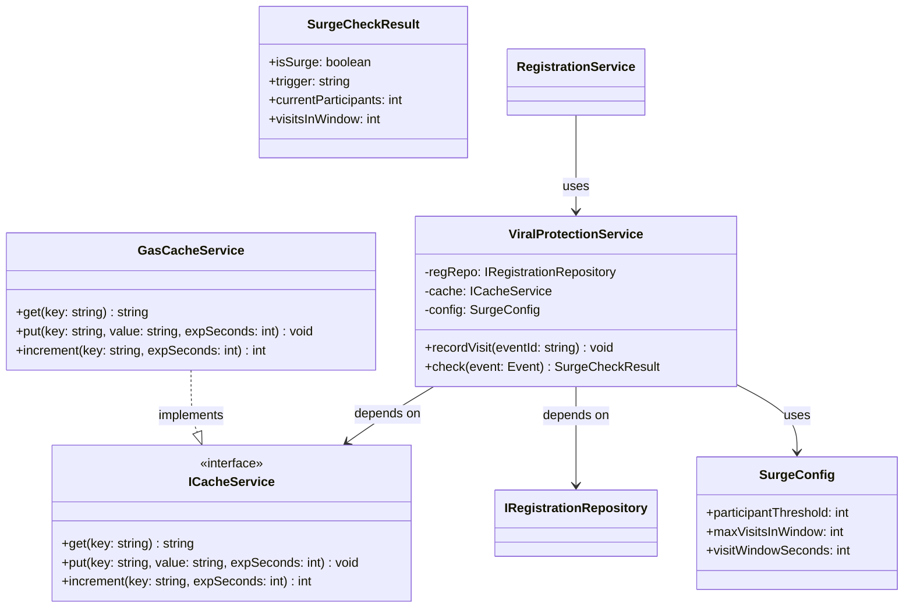

# Quietschente – Surge Protection: Viralen Spread bremsen

**Version:** 1.0 | **Datum:** 2026-06-29 | **Basis:** SOLID-Architektur, datenarchitektur-solid-quietschente.md

---

## Problem & Ziel

Wenn ein Event unerwartet viral geht (z.B. jemand postet den Link in einer grossen WhatsApp-Gruppe), können innerhalb von Minuten hunderte Aufrufe eingehen und die Teilnehmerzahl explodieren. Das führt zu:

- Race Conditions beim Eintragen in Google Sheets (GAS hat ein Kontingent)
- Unüberschaubarer manueller Aufwand für den Organisator
- Potentieller Missbrauch: Event-Kapern durch organisierte Gruppen

**Trigger für Surge-Modus** (beide Bedingungen müssen gleichzeitig gelten):
1. **Hohe Aufrufrate**: Mehr als `MAX_VISITS_IN_WINDOW` Seitenaufrufe der Event-Seite innerhalb von `VISIT_WINDOW_SECONDS`
2. **Teilnehmerzahl > 50**: Der Event hat bereits ≥ `PARTICIPANT_THRESHOLD` angemeldete Teilnehmer

**Verhalten im Surge-Modus**:
- Neue Anmeldungen werden nicht direkt bestätigt, sondern landen als `"wartend"` zur manuellen Freigabe
- Benutzer sieht freundliche Erklärung: hohe Nachfrage, Anmeldung in Warteschlange
- Admin-E-Mail wird ausgelöst: Event im Surge-Modus, manuelle Prüfung nötig

---

## Neue Komponenten (SOLID-konform)

### 1. `SurgeCheckResult` (Value Object)

```
class SurgeCheckResult {
    +isSurge: boolean
    +trigger: string           // 'none' | 'rate_and_capacity'
    +currentParticipants: int
    +visitsInWindow: int
    +thresholdParticipants: int  // 50
    +thresholdVisits: int        // z.B. 30 in 5 Min
}
```

Immutables Value Object — kein Zustand, keine Methoden ausser Getter.

### 2. `ICacheService` (neues Interface, DIP)

```
interface ICacheService {
    +get(key: string): string | null
    +put(key: string, value: string, expirationSeconds: int): void
    +increment(key: string, expirationSeconds: int): int
}
```

Warum ein Interface? Damit Tests ohne echten GAS-Cache laufen können (Liskov-Substitution: `MockCacheService` austauschbar gegen `GasCacheService`).

### 3. `GasCacheService` (neue Infrastruktur-Klasse)

```
class GasCacheService implements ICacheService {
    -cache: GoogleAppsScript.Cache.Cache   // CacheService.getScriptCache()
    +get(key: string): string | null
    +put(key: string, value: string, expirationSeconds: int): void
    +increment(key: string, expirationSeconds: int): int
        // liest aktuellen Wert, +1, schreibt zurück (atomisch soweit GAS es erlaubt)
}
```

GAS `CacheService` hat max. 6h TTL und max. 100KB pro Eintrag — hier nur kleine int-Strings.

### 4. `ViralProtectionService` (neuer Domain Service)

```
class ViralProtectionService {
    -regRepo: IRegistrationRepository
    -cache: ICacheService
    -config: SurgeConfig
    +constructor(regRepo: IRegistrationRepository, cache: ICacheService, config: SurgeConfig)
    +recordVisit(eventId: string): void
    +check(event: Event): SurgeCheckResult
    -_getVisitCount(eventId: string): int
    -_getParticipantCount(eventId: string): int
    -_cacheKey(eventId: string): string   // "surge_visits_<eventId>"
}
```

**Single Responsibility**: Nur zuständig für Surge-Erkennung. Weiss nichts von Spam.

### 5. `SurgeConfig` (Value Object / Konfiguration)

```
class SurgeConfig {
    +participantThreshold: int     // default: 50
    +maxVisitsInWindow: int        // default: 30
    +visitWindowSeconds: int       // default: 300 (5 Minuten)
    +constructor(overrides?: Partial<SurgeConfig>)
}
```

Konfiguration als eigener Typ statt Magic Numbers. Organisator kann pro Gruppe überschreiben.

---

## Änderungen an bestehenden Klassen

### `RegistrationService` — minimale Erweiterung

```javascript
class RegistrationService {
  constructor(regRepo, profileRepo, spamChecker, emailService, viralProtection) {
    //                                                         ↑ NEU
    this.viralProtection = viralProtection;
  }

  register(command) {
    const profile = /* ... */;
    const registration = new Registration(command.eventId, profile.id, command.fields);

    // 1. Spam-Check (unverändert)
    const spamResult = this.spamChecker.check(registration, command.meta);

    // 2. NEU: Surge-Check — überschreibt Status nur wenn nötig
    if (spamResult.status === 'angefragt') {
      const surgeResult = this.viralProtection.check(command.event);
      if (surgeResult.isSurge) {
        registration.flagAsWaiting('surge');   // status = 'wartend'
      }
    }

    this.regRepo.save(registration);
    this.emailService.sendConfirmation(profile, registration, command.event);
    return registration;
  }
}
```

Der Surge-Check läuft **nach** dem Spam-Check. Spam-Registrierungen werden nie freigegeben; saubere Registrierungen kommen in die Warteschlange wenn Surge aktiv ist.

### `Registration` — neue Methode `flagAsWaiting(reason)`

```javascript
// In Registration:
flagAsWaiting(reason) {
    if (this.status !== 'angefragt') throw new Error('Nur angefragt kann wartend werden');
    this.status = 'wartend';
    this.waitReason = reason; // 'surge' | 'manual_review'
}
```

### `EmailService` — neue E-Mail-Templates

- `sendWaitingConfirmation(profile, registration, event)` — für Benutzer: "Hohe Nachfrage, du bist in der Warteschlange"
- `sendSurgeAlert(organizer, event, surgeResult)` — für Admin: Event im Surge-Modus

### Presentation Layer (GAS `doGet`) — `recordVisit` Aufruf

```javascript
function doGet(e) {
  const eventId = e.parameter.event;
  if (eventId) {
    viralProtectionService.recordVisit(eventId); // ← Aufruf-Zähler erhöhen
  }
  // ... rest of doGet
}
```

---

## Surge-Erkennungs-Algorithmus

```
recordVisit(eventId):
  key = "surge_visits_" + eventId
  count = cache.increment(key, expirationSeconds=300)
  // GAS CacheService: wenn key nicht existiert → 1, sonst +1
  // TTL wird bei jedem Write neu gesetzt (rolling window approximation)

check(event):
  visits = cache.get("surge_visits_" + event.id) ?? 0
  participants = regRepo.countApproved(event.id)  // neue Repo-Methode

  isSurge = (visits >= config.maxVisitsInWindow) AND (participants >= config.participantThreshold)

  return new SurgeCheckResult({
    isSurge,
    trigger: isSurge ? 'rate_and_capacity' : 'none',
    currentParticipants: participants,
    visitsInWindow: visits,
    thresholdParticipants: config.participantThreshold,
    thresholdVisits: config.maxVisitsInWindow
  })
```

**Wichtig**: Nur wenn **beide** Schwellen überschritten sind, greift der Surge-Modus. Ein Event mit 80 Teilnehmern aber normalem Zulauf läuft weiterhin normal. Ein Event mit 100 Aufrufen in 5 Minuten aber erst 10 Anmeldungen (z.B. Bot-Scan) läuft auch normal.

---

## Neue Repo-Methode: `IRegistrationRepository`

```
interface IRegistrationRepository {
  // ... bestehende Methoden ...
  +countApproved(eventId: string): int   // NEU: für Surge-Check
}
```

`GoogleSheetsRegistrationRepository.countApproved()` zählt Zeilen mit `status = 'angemeldet'` — ein einfacher Sheet-Filter.

---

## Aktualisiertes Klassendiagramm (Ausschnitt)



---

## Sequenzdiagramm: Anmeldung im Surge-Modus

```
Benutzer          doGet          ViralProtection     RegistrationService
   │                │                   │                     │
   │── GET /event ──▶│                   │                     │
   │                │── recordVisit() ──▶│                     │
   │                │                   │ cache.increment()    │
   │◀── HTML ───────│                   │                     │
   │                │                   │                     │
   │── POST (Form) ──────────────────────────────────────────▶│
   │                │                   │                     │── spamChecker.check()
   │                │                   │                     │── viralProtection.check()
   │                │                   │◀── check(event) ────│
   │                │                   │── get visits + count│
   │                │                   │── isSurge = true ──▶│
   │                │                   │                     │── registration.flagAsWaiting('surge')
   │                │                   │                     │── regRepo.save()
   │                │                   │                     │── emailService.sendWaitingConfirmation()
   │◀── "Warteschlange" ────────────────────────────────────────
```

---

## Admin-Sicht: Surge freigeben

Der Organisator sieht im Admin-Dashboard eine neue Sektion **"Warteschlange"** mit `status = 'wartend'` Anmeldungen. Er kann:
- **Einzeln freigeben**: `approve(id)` — bestehende Methode, kein neuer Code
- **Alle freigeben**: Batch-Aktion (neue Admin-UI-Funktion, nicht im MVP)
- **Ablehnen**: `reject(id, 'surge_not_approved')` — bestehende Methode

---

## Konfiguration pro Gruppe

`GroupSettings` erhält optionale Surge-Overrides:

```javascript
// GroupSettings (Erweiterung):
surgeConfig: {
    participantThreshold: 50,   // default
    maxVisitsInWindow: 30,      // default: 30 Aufrufe in 5 Min
    visitWindowSeconds: 300     // default: 5 Minuten
}
```

Ein kleinerer Stammtisch (max. 20 Personen) könnte `participantThreshold: 20` setzen.

---

## SOLID-Mapping

| Prinzip | Entscheidung |
|---------|-------------|
| **S** | `ViralProtectionService` prüft nur Surge; `SpamCheckService` prüft nur Spam — getrennt und unabhängig |
| **O** | Neue Surge-Logik = neue Klasse. `RegistrationService` ändert sich minimal (ein neuer Check-Aufruf) |
| **L** | `MockCacheService` ist vollständig austauschbar gegen `GasCacheService` in Tests |
| **I** | `ICacheService` hat nur 3 Methoden — Services sehen nie mehr als sie brauchen |
| **D** | `ViralProtectionService` kennt nur `ICacheService`, nie `GasCacheService`. Bindung an GAS-Cache ist Infrastruktur-Entscheidung |

---

## Offene Fragen / Entscheidungen

| Frage | Option A | Option B |
|-------|----------|----------|
| Cache-Granularität | Rolling Window via GAS `increment()` (approximiert) | Exakte Event-Queue mit Timestamps im Sheet (teurer, genauer) |
| Surge-Ende | Automatisch wenn Window abläuft (5 Min ohne neue Visits) | Manuelles Deaktivieren durch Admin |
| Benutzer-Feedback | "Warteschlange" direkt im UI | Erst nach Admin-Freigabe E-Mail schicken (nichts im UI) |
| Schwellen | Hardcoded 50 Teilnehmer + 30 Visits | Konfigurierbar pro Gruppe via `GroupSettings` (**empfohlen**) |
